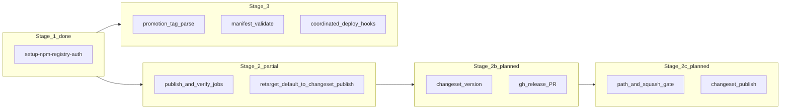

# Implementation plan: registry auth, publish job/command, Changesets, release manifests

This document captures **staged implementation work** for `chiubaka/circleci-orb` and the **design decisions** agreed for this effort. **Normative repo-level product decisions** live in [ADR 0001: Chiubaka CircleCI orb design defaults and escape hatches](../adr/0001-chiubaka-circleci-orb-design-defaults-and-escape-hatches.md). **Org-wide release policy** remains in org ADRs under [`org/docs/adr/`](../../org/docs/adr/).

## Agreed conventions (release PR + squash subject)

These choices drive Stage 2b/2c implementation. Stage **2c** squash gate uses a **prefix-only** regex (see decisions table); the **full** title line remains the org standard for PRs and release-branch commits.

| Item | Convention |
|------|------------|
| **Release branch name** | `release/<default-branch-name>` — e.g. `release/main`, `release/master`. The segment after `release/` matches the repo **default branch** (same value as orb `primary-branch` / client default). |
| **PR title (and squash merge commit subject)** | `chore(release): version packages (scope@x.y.z, …)` — **npm package names** (not only workspace folder names), each with **semver**, listed **in alphabetical order** by package name, inside the parentheses. Example: `chore(release): version packages (@chiubaka/foo@0.2.0, @chiubaka/bar@1.4.0)`. |
| **PR body** | **Grouped changelog summary** from the CHANGELOG updates produced by `changeset version`: **Major / Minor / Patch** sections, one package bullet per section with nested change bullets, plus **Published versions** (same formatter as the GitHub Release train notes). Regenerated when the release PR is refreshed. |
| **Commit message on `release/<branch>`** | **Same Conventional Commit pattern as the PR title**, recomputed on each update to reflect the **current** set of versioned packages (e.g. new packages picked up by dependency bumps). **Single-line subject** = full title string; optional body may duplicate or expand (implementation detail). |

The release PR is **updated in place** on that branch; the **title and commit subject** are **regenerated** on each run so they stay aligned with the packages being versioned.

## Decisions summary (see ADR 0001)

| Topic | Decision |
|--------|-----------|
| **CI ownership** | **CircleCI-only** for Changesets release flows: no split to GitHub Actions for version PRs or publish; orchestration lives in this orb + client `config.yml`. |
| **Scripts ownership** | Shared bash lives **in this orb repo** for now; extract a separate npm package only when pain justifies it. Use **Bats** / shellcheck as today. |
| **Jobs vs commands** | Ship **commands** and **jobs** for setup, auth, **release PR**, **merge gate**, and **publish**. Clients may **replace a whole job**, **reuse** it, or **override** steps / script names via parameters. |
| **Release PR** | On **push to default branch**, when Changesets reports **pending releases**, CI runs `changeset version`, commits, pushes **`release/<default-branch>`**, and **creates or updates** one GitHub PR into the default branch. Uses **`gh`** (or GitHub API) with **`GITHUB_TOKEN`** (CircleCI contexts; simpler than a machine user for now). Document required scopes: **contents**, **pull requests**, push to `release/*`. |
| **2c orchestration** | Use **`circleci/path-filtering`** (continuation) as the **modern CircleCI standard** so gated publish workflows are not invoked on unrelated pushes. |
| **2c squash gate (regex)** | **Prefix-only** match on the squash commit subject, e.g. `^chore\(release\): version packages` — sufficient **for now**; full parenthetical list validation is optional later. |
| **Publish dry-run** | **`pnpm exec changeset publish --dry-run`** when the orb `dry-run` parameter is true. Document a **minimum `@changesets/cli` version**; **fail fast** with a clear error if the installed CLI is older (or lacks the flag). |
| **Publish default** | **Org standard in the orb:** default invocation is **`pnpm exec changeset publish`** (not deferring to client `ci:publish` by default). **Escape hatch:** parameter to run **`pnpm run <script>`** or custom steps. |
| **Publish trigger** | After the **release PR** is **merged**, a **continuation** pipeline (from **path-filtering**) runs **`changeset publish`** only when **all** gates pass: **path/diff signals** **and** **squash merge commit subject** matching the **prefix** pattern (see table above). |
| **Self-contained vs CI minutes** | Publish job must be able to run **standalone** (install + build + publish). Provide parameters (and/or workspace attach patterns) to **skip** install/build when **upstream jobs** already produced artifacts. |
| **YAML style** | **Direction 2:** prefer **explicit orb parameters** (named flags, enums, script names) so client config stays readable; defaults still exist. |
| **Build / Turbo** | Invoke **package.json scripts** for **build** steps; avoid embedding Turbo CLI in the orb; keep coupling in repo scripts per [ADR 0022](../../org/docs/adr/0022-standardize-monorepos-to-pnpm-turbo.md). |
| **GitHub Packages token** | Document **`GITHUB_TOKEN`** for `npm.pkg.github.com` auth in examples (contexts use least-privilege tokens in practice). |
| **Org ADR alignment** | Orb encodes **workflow shape** for [ADR 0024](../../org/docs/adr/0024-use-changesets-for-library-monorepos.md), [0027](../../org/docs/adr/0027-use-single-changesets-workflow-in-hybrid-monorepos.md), [0030](../../org/docs/adr/0030-coordinated-release-model-release-manifests-and-promotion-tags.md), [0031](../../org/docs/adr/0031-separation-of-artifact-tags-and-environment-promotion-tags.md); **escape hatches** remain first-class. |
| **Manifest errors** | **Fail the job** on schema/invariant violation; print **actionable** messages. |
| **Orb semver (pre-1.0)** | Use **minor** bumps for meaningful or potentially breaking orb API changes; **patch** for small fixes until **v1.0**. |

## Default behavior vs escape hatch (publish)

- **Default (target):** Orb runs **`pnpm exec changeset publish`** (and documents **`@changesets/cli`** as an org-standard devDependency with a **documented minimum version**).
- **Dry-run:** **`pnpm exec changeset publish --dry-run`** when the orb `dry-run` parameter is true. Implementations should **check the CLI version early** and **fail loudly** if `--dry-run` is unsupported.
- **Escape hatch:** Parameters to run **`pnpm run <publish-script>`** instead, or **replace publish with custom `steps`**, plus existing **skip install/build**, **attach workspace**, etc.

---

## Current baseline in this repository

**Implemented (partial):**

- [`src/scripts/setupNpmRegistryAuth.sh`](../../src/scripts/setupNpmRegistryAuth.sh) + [`src/commands/setup-npm-registry-auth.yml`](../../src/commands/setup-npm-registry-auth.yml): npmjs + GitHub Packages auth.
- [`src/scripts/runPublish.sh`](../../src/scripts/runPublish.sh) + [`src/commands/publish.yml`](../../src/commands/publish.yml): default **`pnpm exec changeset publish`** (matches org target above); **`publish-script`** / equivalent runs **`pnpm run <script>`** when set.
- [`src/scripts/runChangesetsReleasePr.sh`](../../src/scripts/runChangesetsReleasePr.sh) + [`src/commands/changesets-release-pr.yml`](../../src/commands/changesets-release-pr.yml) + [`src/jobs/changesets-release-pr.yml`](../../src/jobs/changesets-release-pr.yml): **`changeset version`**, commit on **`release/<primary>`**, **`git push`** + **`gh`** create/update PR (see also [`src/commands/install-github-cli.yml`](../../src/commands/install-github-cli.yml)).
- [`src/jobs/publish.yml`](../../src/jobs/publish.yml), [`src/jobs/verify-changesets.yml`](../../src/jobs/verify-changesets.yml), [`src/commands/verify-changesets.yml`](../../src/commands/verify-changesets.yml); [`src/commands/setup.yml`](../../src/commands/setup.yml) extended with `pre-install-steps`, `skip-pnpm-install`, `attach-workspace`.
- Examples under [`src/examples/`](../../src/examples/).

**Still gaps (this plan):**

- **Gated publish** workflow (path filtering + squash message gate; publish default path is already `changeset publish`).
- **Deploy:** [`src/jobs/deploy.yml`](../../src/jobs/deploy.yml) → tag-style deploys unchanged.
- **Manifests / promotion tags** — Stage 3.

**Dependency note:** Stage **2c** (gated publish) depends on **2b** (release PR merge semantics) and **Stage 1** auth. Stage **3** remains parallelizable with **2b/2c** once foundations exist.

---

## Stage 1 — `setup-npm-registry-auth` (npmjs + GitHub Packages) — done

**Goal:** One command supporting **`registry-backend: npmjs`** and **`github-packages`**, aligned with [ADR 0034](../../org/docs/adr/0034-use-github-packages-with-single-chiubaka-scope-for-private-package-distribution.md) and [ADR 0036](../../org/docs/adr/0036-standardize-package-naming-under-chiubaka-scope-with-ecosystem-prefixes.md).

**Work**

- Implement script + command: npmjs lines vs `@owner:registry` + `//npm.pkg.github.com/:_authToken=${GITHUB_TOKEN}` (and document token scopes).
- Preserve backward compatibility: [`authenticateWithNpm.sh`](../../src/scripts/authenticateWithNpm.sh) remains self-contained for legacy `include()` usage.
- Parameters: owner (default `chiubaka`), `always-auth`, read vs publish where applicable.
- Examples under [`src/examples/`](../../src/examples/): npmjs + github-packages.
- Bats: [`test/authenticateWithNpm.bats`](../../test/authenticateWithNpm.bats), [`test/setupNpmRegistryAuth.bats`](../../test/setupNpmRegistryAuth.bats).

**Risk:** Dual registry repos—scope **only** `@chiubaka` to GitHub Packages without breaking public npm installs.

---

## Stage 2 — Publish / verify commands + jobs (ADRs 0023–0028) — partial

**Goal:** Composable **publish** and **verify-changesets** surface; **retarget** default publish to **`pnpm exec changeset publish`** per org table above.

**Done / in repo**

- **`publish` command / job:** [`src/commands/publish.yml`](../../src/commands/publish.yml), [`src/jobs/publish.yml`](../../src/jobs/publish.yml), [`src/scripts/runPublish.sh`](../../src/scripts/runPublish.sh) — **follow-up:** change default from **`ci:publish`** to direct **`changeset publish`**; keep **`publish-script`** (or rename) as escape hatch.
- **`verify-changesets`:** [`src/commands/verify-changesets.yml`](../../src/commands/verify-changesets.yml), [`src/jobs/verify-changesets.yml`](../../src/jobs/verify-changesets.yml), [`src/scripts/runVerifyChangesets.sh`](../../src/scripts/runVerifyChangesets.sh).
- **`setup`:** [`src/commands/setup.yml`](../../src/commands/setup.yml) — `pre-install-steps`, `skip-pnpm-install`, `attach-workspace`.
- Document Changesets policy via links to [0023](../../org/docs/adr/0023-lockstep-versioning-for-related-package-groups.md)–[0028](../../org/docs/adr/0028-version-only-deployable-artifacts-by-default.md); config stays in client `.changeset/`.

**Remaining within Stage 2**

- Align **default publish** implementation with **org standard** (`pnpm exec changeset publish`); update examples and Bats accordingly.

---

## Stage 2b — Changesets release PR (`changeset version` + GitHub PR)

**Goal:** **Automatically create or update** a **running release PR** that contains the repo state **after `changeset version`**, without GitHub Actions. Triggers on **push to the default branch** (e.g. `main`) when **`pnpm exec changeset status`** indicates there are **pending releases** to version (same high-level behavior as `@changesets/action`).

**Conventions (see [Agreed conventions](#agreed-conventions-release-pr--squash-subject) above)**

- Branch: **`release/<default-branch-name>`** (e.g. `release/main`).
- PR title: **`chore(release): version packages (...)`** with **alphabetical** package@version list; PR title is updated when the release PR is refreshed.

**Work**

- **Pipeline / workflow shape:** after checkout + install + auth (as needed), run `changeset status` / documented check; if nothing to release, **exit success** without side effects.
- Run **`changeset version`**; **compute PR title** (alphabetical `name@version` list); set **commit subject** to that **same** Conventional Commit string (recomputed each run as package set changes).
- **PR body:** assemble the **grouped changelog summary** from the CHANGELOG files Changesets updated (scoped to packages in this release) so the PR explains **consumer-visible** changes in the same layout as GitHub Release train notes.
- Push to **`release/<default-branch>`**; open or update PR to default branch via **`gh`**.
- **Idempotency:** one open PR from `release/<default>` → default branch; updates move the same branch / PR.
- **Secrets:** **`GITHUB_TOKEN`** from CircleCI (context) for **`gh`** + git push; document required scopes and branch protection (bots, required reviews). Machine user PAT deferred unless org rules require it.
- **Image:** ensure **`gh`** CLI (or GitHub REST) on [`docker-node`](../../src/executors/docker-node.yml) or document install step.
- **Bats** for helpers; **examples** for client `config.yml`.

**Risk:** Race if multiple pushes to default branch race the same release branch—mitigate with branch locks or documented serialization.

---

## Stage 2c — Gated `changeset publish` on merge to default branch

**Goal:** When the **release PR** is **merged** into **`main`** (or org default), run **`pnpm exec changeset publish`** only if **merge detection** passes. **No** manual pre-publish tag; **Changesets** owns git tags during publish.

**Merge detection (all required — AND)**

1. **Path-filtering (primary):** use **`circleci/path-filtering`** + **continuation** so the publish pipeline runs only when relevant paths change (org standard). Map globs (e.g. `**/package.json`, `**/CHANGELOG.md`, `.changeset/**`) to pipeline parameters; tune in implementation.
2. **Follow-up gate script** (optional but recommended): `**/package.json` version bumps (e.g. `jq`), changelog updates, **deletions** under `.changeset/**`.
3. **Squash merge commit subject:** **prefix-only** regex match, default `^chore\(release\): version packages` (parameterized). Full parenthetical validation **deferred** — prefix is enough **for now**.

**Prerequisite:** **Squash merge** into default branch so the squash **subject** starts with the same prefix as the release PR title (GitHub: use PR title as squash subject).

**Work**

- **`assert-release-merge` (name TBD) command:** runs the text gate (and optional diff checks); **fails fast** with actionable logs when not a qualified release merge.
- **`changesets-publish` (name TBD) job:** `setup` → `setup-npm-registry-auth` → optional build → **`pnpm exec changeset publish`** by default; **`pnpm exec changeset publish --dry-run`** when orb requests dry-run; escape hatch for `pnpm run` / custom steps.
- **Workflow docs** (path-filtering + continuation wiring) + **Bats** (negative fixtures).

**Risk:** False positives if non-release edits touch the same paths—tighten jq / globs as needed.

---

## Stage 3 — Manifests and promotion tags (ADRs 0030–0031)

**Goal:** Scripts and commands for `staging-*` / `prod-*` tags, `.releases/<id>.yml` validation (fail fast, helpful errors), phased deploy via **hooks** (e.g. `pnpm deploy:ci`-style), reusing patterns from [`deployMonorepoPackage.sh`](../../src/scripts/deployMonorepoPackage.sh).

**Work**

- `parsePromotionTag.sh` → env: `PROMOTION_ENV`, `RELEASE_ID`.
- `validateReleaseManifest.sh` → exit non-zero + message on violation.
- `exportCoordinatedReleaseEnv.sh` (optional).
- **`coordinated-deploy` job/command:** setup → validate → user hooks per phase.
- Workflow docs: promotion tags vs artifact tags [0031](../../org/docs/adr/0031-separation-of-artifact-tags-and-environment-promotion-tags.md).
- Bats + fixtures under `test/fixtures/`.

**Tooling:** Confirm `yq` / `jq` / node on [`docker-node`](../../src/executors/docker-node.yml) or install in command.

---

## Delivery order

1. **Stage 1** — done.
2. **Stage 2** — complete **default publish retarget** (`changeset publish` default, script override escape hatch).
3. **Stage 2b** — release PR automation (unblocks the merge signal for 2c).
4. **Stage 2c** — gated publish pipeline.
5. **Stage 3** — manifests / promotion tags (parallelizable with 2b/2c after Stage 1).

---

## Open implementation details (to resolve during build)

- **Exact path-filtering mapping** (globs → continuation parameters) per monorepo layout.
- **Grouped release notes assembly:** full top `CHANGELOG.md` section per changed package (no arbitrary line cap on the GitHub Release path), grouped by Changesets **Major / Minor / Patch** headings across packages, plus **Published versions**; PR bodies share the same formatter with a separate max-length truncate for GitHub PR limits.
- **Minimum `@changesets/cli` version** number and where to assert it (`pnpm exec changeset --version` vs `package.json` engines).
- **Default branch rename:** ensure `release/<primary-branch>` tracks renames (parameter always from client).
- **2c diff base:** single-parent squash on default branch — validate `git log -1` shape in gate script if needed.
- Workspace parameter naming (partially addressed in [`setup.yml`](../../src/commands/setup.yml)).

---

## Tracking

Historical Cursor plan id may reference this file as the canonical plan: `docs/plans/orb-release-and-registry-workflows.md`.
